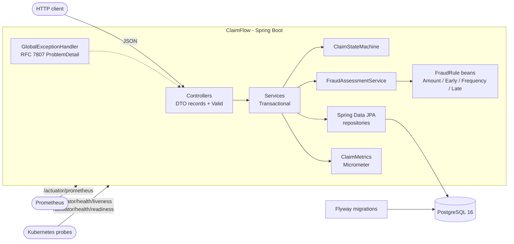
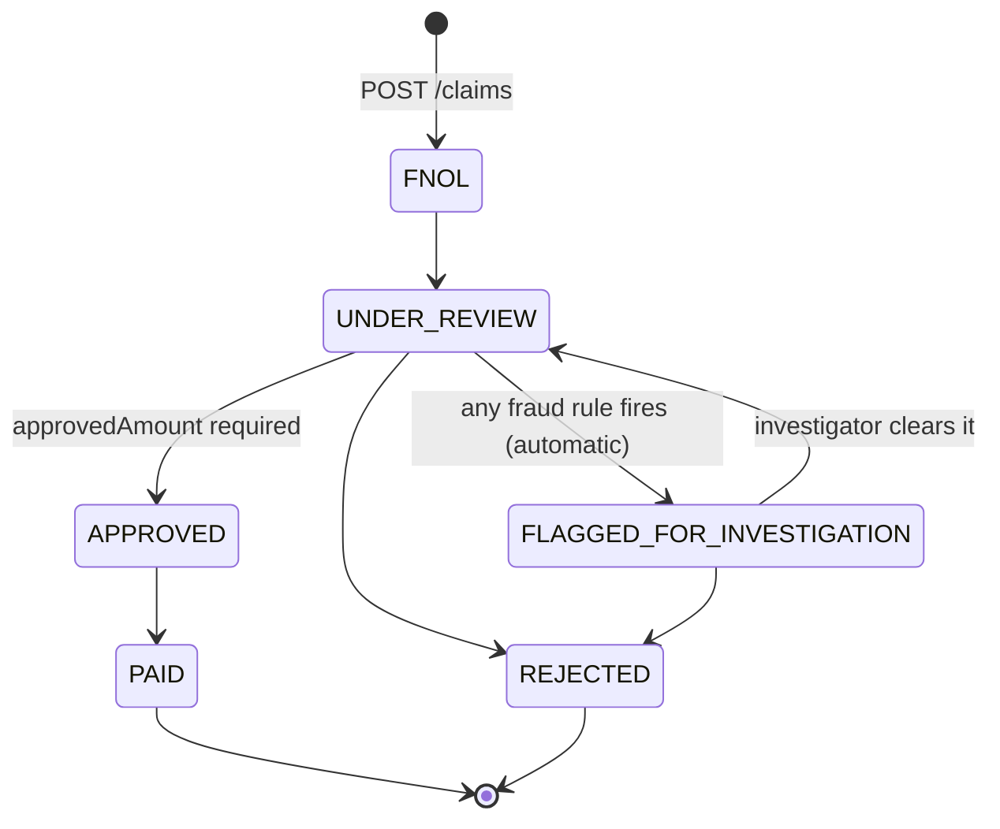

# ClaimFlow

[](https://github.com/PreethamSanji/ClaimFlow/actions/workflows/ci.yml)

ClaimFlow is a small, production-style backend for **property & casualty (P&C) insurance claims**.
Customers hold policies (auto, home, property). When something goes wrong they file a claim
(FNOL, "first notice of loss"). Adjusters then move it through a strict lifecycle: review, approve, pay.
A pluggable fraud-rules engine can automatically send suspicious claims to investigation.
I picked this domain because it is what Guidewire's products (ClaimCenter, PolicyCenter) do.
It also has real backend problems in a small space: money math, a state machine, audit trails,
concurrent edits, and configurable business rules.

**Stack:** Java 21 · Spring Boot 3.5 · Spring Data JPA · PostgreSQL 16 · Flyway · Bean Validation ·
springdoc-openapi · Actuator + Micrometer/Prometheus · JUnit 5 · Mockito · AssertJ · Testcontainers ·
Docker · Helm 3 · GitHub Actions

---

## Architecture



Code is grouped **by feature** (`customer`, `policy`, `claim`, `fraud`), not by layer, so everything
about claims lives in one package.

```
src/main/java/com/claimflow
├── ClaimFlowApplication.java
├── common/         exceptions, GlobalExceptionHandler, PageResponse
├── config/         Clock bean, OpenAPI info
├── customer/       entity, repository, service, controller, DTOs
├── policy/         entity, repository, service, controller, DTOs
├── claim/          Claim, ClaimEvent, ClaimStateMachine, ApprovalLimits, service, controller, DTOs
├── fraud/          FraudRule + 4 rules, FraudAssessmentService, FraudProperties
└── observability/  ClaimMetrics
```

## Claim lifecycle



- All moves live in one table in `ClaimStateMachine`. Anything else returns **409**.
- **Approval rule:** `approvedAmount <= min(coverageLimit, max(0, claimedAmount - deductible))`, otherwise **422**.
- **Fraud rules run once**, on `FNOL -> UNDER_REVIEW`. A claim returning from investigation is not re-checked,
  because a human already cleared it.
- Every status change writes one `claim_event` row (from, to, reason, actor, time).

## API (`/api/v1`)

| Method | Path | Notes |
|---|---|---|
| POST | `/customers` | 201 + `Location`; 409 on duplicate email |
| GET | `/customers/{id}` | |
| POST | `/policies` | policy number generated, e.g. `POL-2026-000123` |
| GET | `/policies/{id}` | |
| GET | `/policies?customerId=` | |
| POST | `/claims` | FNOL. 422 if policy not ACTIVE, incident outside policy dates, or in the future |
| GET | `/claims/{id}` | |
| GET | `/claims?status=&policyId=&page=&size=` | paged, newest first, `size` max 100 |
| POST | `/claims/{id}/transitions` | body `{ "toStatus", "reason", "approvedAmount"? }` |
| GET | `/claims/{id}/events` | audit trail |

The optional `X-Actor` header names who made the change (there is no auth in this project).
Errors are always RFC 7807 `application/problem+json`:

```json
{
  "type": "about:blank",
  "title": "Invalid claim transition",
  "status": 409,
  "detail": "Cannot move a claim from PAID to APPROVED",
  "instance": "/api/v1/claims/5/transitions",
  "fromStatus": "PAID",
  "toStatus": "APPROVED"
}
```

Swagger UI: <http://localhost:8080/swagger-ui.html>

## Run locally

Needs Docker. Java 21 + Maven are only needed if you run outside Docker.

```bash
# Everything in Docker (app uses the "dev" profile, which loads seed data)
docker compose up --build

# Or: only Postgres in Docker, app from your IDE / Maven
docker compose up -d postgres
mvn spring-boot:run -Dspring-boot.run.profiles=dev
```

Try it:

```bash
# Seed data has 6 claims in different states
curl localhost:8080/api/v1/claims?size=10

# Move the FNOL claim into review
curl -X POST localhost:8080/api/v1/claims/1/transitions \
  -H 'Content-Type: application/json' -H 'X-Actor: adjuster.kim' \
  -d '{"toStatus":"UNDER_REVIEW","reason":"Assigned to adjuster"}'

curl localhost:8080/api/v1/claims/1/events
curl localhost:8080/actuator/prometheus | grep claims_
```

## Run tests

```bash
mvn test      # unit + web-slice tests (no Docker needed)
mvn verify    # also runs *IT integration tests against real Postgres via Testcontainers (needs Docker)

# Helm chart
helm lint deploy/helm/claimflow
helm template claimflow deploy/helm/claimflow
helm plugin install https://github.com/helm-unittest/helm-unittest   # once
helm unittest deploy/helm/claimflow
```

## Deploy with Helm (kind or minikube)

```bash
kind create cluster --name claimflow

# Build the image and load it into the cluster (minikube: `minikube image load claimflow:dev`)
docker build -t claimflow:dev .
kind load docker-image claimflow:dev --name claimflow

# A throwaway Postgres for the demo
kubectl run postgres --image=postgres:16-alpine \
  --env=POSTGRES_DB=claimflow --env=POSTGRES_USER=claimflow --env=POSTGRES_PASSWORD=claimflow --port=5432
kubectl expose pod postgres --port=5432

# DB credentials live in a Secret the chart does NOT create. Secret name and keys are configurable.
kubectl create secret generic claimflow-db \
  --from-literal=username=claimflow --from-literal=password=claimflow

helm install claimflow deploy/helm/claimflow \
  --set image.repository=claimflow --set image.tag=dev \
  --set database.url=jdbc:postgresql://postgres:5432/claimflow \
  --set config.springProfiles=dev

kubectl rollout status deploy/claimflow
kubectl port-forward svc/claimflow 8080:80
```

Useful chart values: `replicaCount`, `image.tag` / `image.digest` (the digest wins when set),
`database.existingSecret.{name,usernameKey,passwordKey}`, `resources`, `config.fraud.*`,
`serviceMonitor.enabled` (off by default, needs the Prometheus Operator).

## Observability

- `GET /actuator/health/liveness` and `/readiness`. Readiness includes the DB check; liveness does not,
  so a DB outage takes pods out of the load balancer without restarting them all.
- `GET /actuator/prometheus` with custom metrics:
  - `claims_filed_total` (the spec said `claims_created_total`, but the Prometheus client used by
    Spring Boot 3.5 strips the reserved `_created` suffix, so that name can't be produced)
  - `claims_transitions_total{from,to}`
  - `claims_fraud_flags_total{rule}`
  - `claims_fraud_assessment_seconds` (timer, with histogram buckets)
- JSON logs (Elastic Common Schema) with `claimNumber` in the MDC for claim operations.

## Design decisions & trade-offs

| Decision | Why | Trade-off / alternative rejected |
|---|---|---|
| **BigDecimal for money**, `NUMERIC(15,2)` in the DB | `double` can't store 0.10 exactly, and rounding errors in payouts are not acceptable | More verbose (`compareTo` instead of `<`). Rejected: `double`, or long cents (safe, but less readable) |
| **Optimistic locking** (`@Version`) | Two adjusters editing the same claim is rare. A conflict should fail fast with 409, not silently overwrite | The loser must retry. Rejected: pessimistic `SELECT ... FOR UPDATE`, which holds DB locks and scales worse |
| **State machine in one class** | All legal moves in one table: easy to read, test every pair, change | Rejected: `if` checks scattered in services, or a state-machine library (too heavy for 6 states) |
| **Pluggable fraud rules** (`FraudRule` beans) | Spring injects `List<FraudRule>`, so a new rule is one new class (open/closed principle) | Rule order is bean order. Rejected: one big method with every check |
| **Thresholds in `application.yml`** (`@ConfigurationProperties` record, validated) | Change thresholds per environment without code changes. Bad values fail at startup | Needs a restart to change. Rejected: hard-coded constants |
| **Flyway, `ddl-auto=none`** | Schema changes are reviewed, versioned SQL, and run the same everywhere | More work than letting Hibernate generate tables. Rejected: `ddl-auto=update`, which can't rename or drop safely and gives no history |
| **DTO records, never entities, in the API** | API shape stays stable when the DB changes. No lazy-loading surprises. No mass-assignment of fields like `status` | Mapping code. Rejected: returning entities directly |
| **ProblemDetail (RFC 7807)** for all errors | One standard error format for every client | — |
| **`open-in-view: false`** | DB connections aren't held while JSON is written. Lazy-loading bugs show up in tests, not prod | DTOs must be built inside the service transaction |
| **Clock bean** | Tests can freeze "today", which matters for date rules | One more constructor parameter |
| **Auto-flag in the same transaction** as the review move | The claim is never visible as "UNDER_REVIEW but actually suspicious" | Fraud rules must be fast (they are: in-memory checks + one count query) |

**Known limitations:** no auth (the `X-Actor` header is trusted), no idempotency keys on POST, and metrics are
counted before the transaction commits (a rolled-back request can still be counted). The `claim` and `fraud`
packages depend on each other. These were fine to leave out for a project of this size.

## Tests

Counts below come from the test source code (JUnit parameterized cases expanded).

| Layer | Classes | Test cases | What they cover |
|---|---|---|---|
| Unit: state machine | `ClaimStateMachineTest` | 43 | All 7 valid moves, all 29 invalid (from, to) pairs, terminal states |
| Unit: money | `ApprovalLimitsTest` | 8 | Deductible math, below-deductible -> 0, coverage cap, one-cent edges |
| Unit: fraud rules | 4 rule tests | 20 | Boundaries: exactly 7 days (flag) vs 8, exactly 3 claims (flag) vs 2, day 30 vs day 31, limit vs +0.01 |
| Unit: fraud engine | `FraudAssessmentServiceTest`, `FraudPropertiesTest` | 7 | Flags collected from all rules, context/window, metrics, YAML binding, invalid config fails startup |
| Unit: services | `ClaimServiceFnolTest`, `ClaimServiceTransitionTest`, `CustomerServiceTest`, `PolicyServiceTest` | 29 | FNOL rules (inactive policy, future date, date range edges), approval limits, auto-flag + audit rows, no re-check after investigation |
| Unit: metrics | `ClaimMetricsTest` | 4 | Counter/timer names and tags |
| Web slice | `CustomerControllerTest`, `PolicyControllerTest`, `ClaimControllerTest` (`@WebMvcTest`) | 25 | Validation -> 400 with field errors, 404/409/422 ProblemDetail shape, paging limits, `X-Actor` default |
| Integration | `ClaimFlowApplicationIT`, `ClaimLifecycleIT`, `ClaimConcurrencyIT`, `ObservabilityIT` (Testcontainers Postgres) | 12 | Full FNOL -> review -> flagged -> review -> approved -> paid flow, frequency rule on real data, concurrent transitions -> one 200 and one 409, probes, Prometheus metrics, OpenAPI |
| Helm | `deploy/helm/claimflow/tests/*.yaml` (helm-unittest) | 14 | Tag vs digest, secret name/keys, probes, resources, non-root, ConfigMap values, ServiceMonitor toggle |

**Total: 136 unit/web test cases + 12 integration tests + 14 Helm tests.**

> Note: this code was written in an environment without a JDK, Maven, Docker, or Helm, so the counts above
> come from the source and have **not** yet been confirmed by a run. CI (`.github/workflows/ci.yml`) runs
> `mvn verify`, builds the image, and runs `helm lint` + `helm unittest` on every push. Check the Actions tab for real results.

## More

A deep-dive walkthrough of the code, the Java/Spring concepts behind it, and interview questions is in
[`docs/EXPLANATION.md`](docs/EXPLANATION.md).
